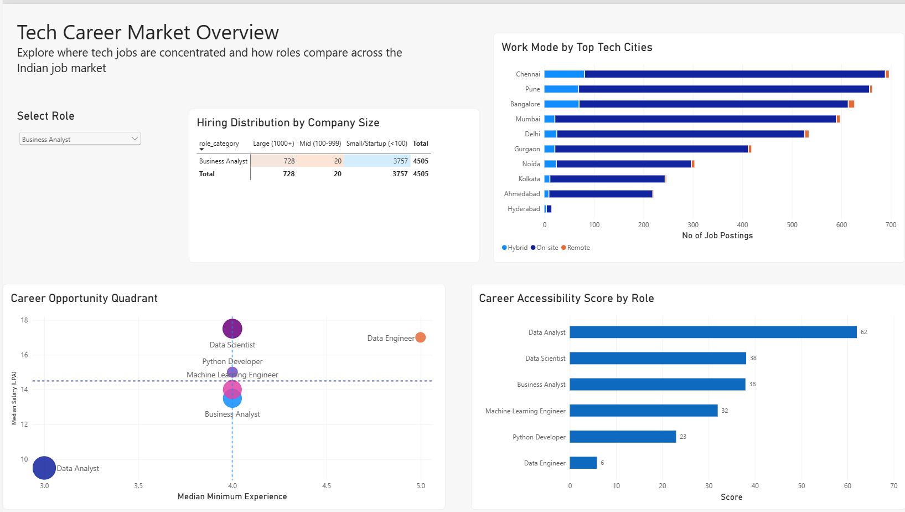
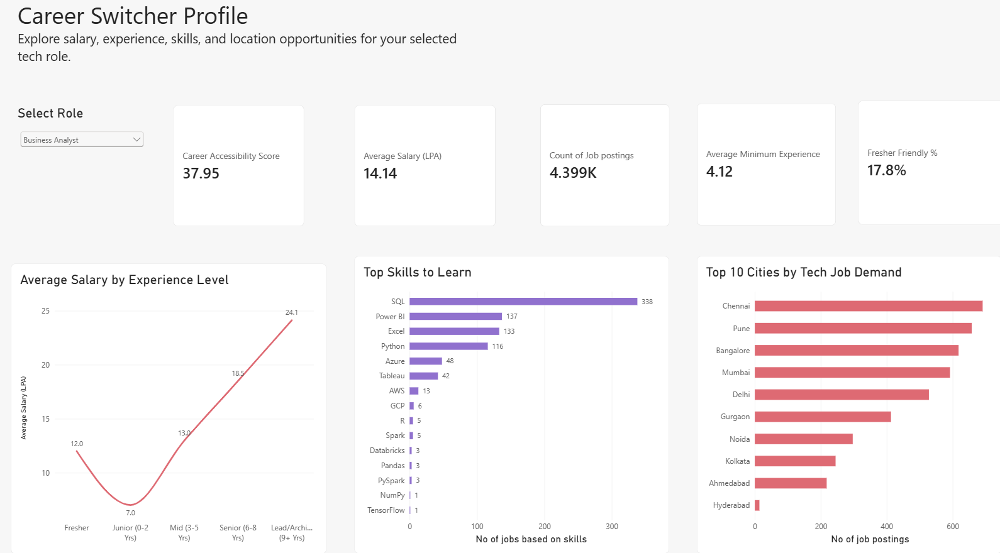

# Tech Career Trends in India 2026

A Power BI dashboard designed exclusively for people transitioning into technology careers in India. It helps career switchers compare roles by job demand, experience requirements, salary, skills, location, and work arrangements to make informed decisions about their next career path.

**Data period:** the dataset and repository titles contain “2026”, but every supplied record has `scraped_at = 2025-06-10`. The Kaggle description also identifies a 2025 snapshot. Treat the results as analysis of that snapshot, not current vacancies or a year-over-year trend.

**Report status:** the supplied PBIX is included unchanged. Its **Job Postings** card currently counts expanded skill rows, so use the verified posting counts below until the card is bound to the existing `Job Postings orig` measure. The [validation notes](docs/data-quality.md#report-check-posting-card) explain the issue and correction. Screenshots of both dashboard pages are included below. An interactive Power BI Service link is not included in this version.

## Explore the project

- [Download the Power BI report](powerbi/Tech%20Trends%20for%20Freshers.pbix)
- [Dataset and attribution](data/README.md)
- [Methodology and accessibility score](docs/methodology.md)
- [Data dictionary](docs/data-dictionary.md)
- [Validation findings](docs/data-quality.md)
- [Open and refresh the report](docs/setup.md)
- [Extracted DAX measures](model/measures.dax) and [Power Query steps](model/power-query)

## Dashboard pages

The screenshots below are static previews supplied by the project author, with **Business Analyst** selected on both pages.

### 1. Career Accessibility

The page heading is **Tech Career Market Overview**. This page helps career switchers compare potential technology career paths by examining entry requirements, salary, fresher-friendly opportunities, work arrangements, and hiring patterns. It contains:

- Work mode by collection city (`scraped_city`).
- Hiring distribution by company size and role.
- A career opportunity quadrant: median minimum experience on the horizontal axis, median disclosed salary on the vertical axis, and fresher-friendly posting count as bubble size.
- Career Accessibility Score by role.



### 2. Career Switcher Profile

This page helps a career switcher explore a chosen target role and plan their transition. Select one role to inspect its accessibility score, average disclosed salary, posting count, average minimum experience, and fresher-friendly share. Supporting charts help users identify skills to learn, compare advertised salaries across experience tiers, and explore the top collection cities.



The saved role selection is **Data Analyst**. Role selectors are synchronized across pages. On the overview page, the role selector does not filter the score comparison or opportunity quadrant, preserving the comparison across roles.

## Snapshot findings

- **23,201 records**, **32 source columns**, and **6 role categories**.
- **4,182 records (18.0%)** are flagged as fresher-friendly.
- **2,768 records (11.9%)** disclose salaries. The median of their salary midpoints is **14.0 LPA**.
- **Data Scientist** has the largest record count: **6,455**.
- **Data Analyst** has the highest score under this project's chosen accessibility formula: **62.02**.

| Role | Postings | Fresher-friendly | Disclosed salaries | Median salary (LPA) | Accessibility score |
| --- | --- | --- | --- | --- | --- |
| Data Analyst | 4,729 | 27.2% | 640 | 9.5 | 62.02 |
| Data Scientist | 6,455 | 13.6% | 757 | 17.5 | 38.10 |
| Business Analyst | 4,505 | 17.8% | 460 | 13.5 | 37.95 |
| Machine Learning Engineer | 4,004 | 19.8% | 473 | 14.0 | 31.96 |
| Python Developer | 1,586 | 13.8% | 222 | 15.0 | 22.95 |
| Data Engineer | 1,922 | 10.3% | 216 | 17.0 | 5.85 |

These values are independently reproduced from the unchanged CSV with no report filters. LPA means lakh rupees per annum. Salary comparisons use the midpoint of the advertised range and only records flagged `salary_disclosed = TRUE`. Repeated URLs mean record counts should not be interpreted as unique live vacancies.

## How the accessibility score works

```text
Career Accessibility Score =
    40% × Fresher Friendly Score
  + 35% × Experience Accessibility Score
  + 25% × Demand Score
```

The demand component normalizes posting counts across roles. The experience component rewards lower average minimum experience. Fresher friendliness is the percentage of records flagged as fresher-friendly. The weights are project design choices; the score is a comparison within this dataset, not a probability of getting hired. See the [full formulas and filter behavior](docs/methodology.md).

## Data model and preparation

The report has two business tables:

- `indian_tech_jobs_2026`: 23,201 job records, with 31 columns after the report's transformations.
- `Job Skills Cleaned`: 176,390 job–skill rows across 22,657 job IDs.

A one-to-many relationship connects the main table's `job_id` to the skills table's `Job postings` column. Filters flow from jobs to skills. Skill measures count distinct job IDs so that several skills on one posting do not inflate each skill's posting count.

The CSV already contains fields such as salary midpoint, experience tier, company-size bucket, work mode, and fresher-friendly flag. Power Query assigns types, formats job titles, removes two source columns, adds an experience sort key, and expands/cleans skills. It does not recreate all of those upstream features. The exact query text is included in [model/power-query](model/power-query).

## Validation and interpretation

The file has no duplicate rows or duplicate `job_id` values. It does contain **53 missing URL markers**, **2,078 repeated nonmissing URLs beyond their first occurrence**, **90 reversed experience ranges**, and **2 zero salary midpoints marked as disclosed**. The source data is retained unchanged. Details and report-specific checks are in [data-quality.md](docs/data-quality.md).

## Reproduce the checks

Download or clone the repository, then run with Python 3.10 or later:

```sh
python scripts/audit_dataset.py
```

This uses the Python standard library, prints checks and role metrics as JSON, and does not modify the CSV. An alternative input path can be passed as the first argument.

## Source and reuse

Dataset: [Indian Tech Job Market 2026 | 23K+ Records](https://www.kaggle.com/datasets/shree0910/india-tech-job-market-2026-23k-records), published by **Shreyash Gade (`shree0910`)** on Kaggle, version 1. The dataset lists Naukri.com as its upstream source and is published under **[CC BY-SA 4.0](https://creativecommons.org/licenses/by-sa/4.0/)**. The included CSV is byte-for-byte identical to that download. See [DATA_LICENSE.md](DATA_LICENSE.md) for attribution and scope.
